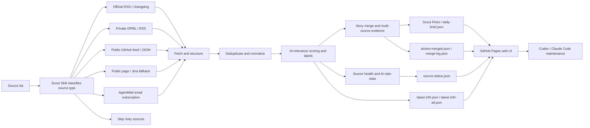

<div align="center">

# Private Intelligence Observatory

## Domain Intelligence Methodology and Briefing System

**A decision-first system for turning overlooked domains, knowledge areas, industries, and sectors into auditable, continuously maintained intelligence radars.**

[](https://github.com/mizzlelover/private-intelligence-observatory/actions/workflows/domain-intelligence.yml)
[](LICENSE)

[Core methodology](docs/DOMAIN_INTELLIGENCE_V0_1.md) · [Engine](packages/domain-intelligence/README.md) · [Scope and attribution](docs/PROJECT_SCOPE_AND_ATTRIBUTION.md) · [中文](README.md)

</div>

---

> **Scope and attribution:** the core of this project is the domain-intelligence methodology and engine. The retained AI News Radar, Radar Skill, and Scout/Bole Skill are optional compatibility components from or based on LearnPrompt/ai-news-radar, not this project's original core. Read [NOTICE](NOTICE.md) and [scope and attribution](docs/PROJECT_SCOPE_AND_ATTRIBUTION.md) first.

## What this project is

This repository is the implementation of Private Intelligence Observatory, and it is methodology-first. Its core loop is:

```text
Decision context
→ Intelligence Requirement Graph
→ Essential Information Elements
→ Expert Attention Reconstruction
→ Point-in-time Source Benchmark
→ Source Portfolio
→ Coverage Audit
→ Domain-ranked Daily Brief
→ Feedback
```

The daily brief is an output format. The durable value is the requirement model, evidence timeline, source evaluation, coverage denominator, and feedback loop behind it.

## Start in 30 seconds

1. Read the [core methodology](docs/DOMAIN_INTELLIGENCE_V0_1.md) and define the decision context, PIRs, EIEs, topic weights, and event priorities.
2. Run the [Domain Intelligence Bootstrap](packages/domain-intelligence/README.md):

```bash
uv run --project packages/domain-intelligence dib \
  packages/domain-intelligence/examples/data-elements.json \
  --output-dir out/domain-intelligence
```

3. Convert public feeds, pages, databases, email, or other adapters into structured signals and pass them to the core engine. Collection, delivery, and a ready-made web page are replaceable boundary layers.
4. If you only need an AI news brief, use the separately marked [AI News Radar compatibility layer](#optional-adapter-ai-news-radar--scout-skill). It is not this project's core methodology or an original Skill of this project.

## Scope, ownership, and attribution

The core project additions are the domain-intelligence methodology, schemas, replay/portfolio/coverage engine, and domain adapter boundary. The retained AI News Radar page, fetch pipeline, Radar Skill, and Scout/Bole Skill are a separate compatibility layer. See [scope and attribution](docs/PROJECT_SCOPE_AND_ATTRIBUTION.md) and [NOTICE](NOTICE.md) before treating those paths as project-original.

## Optional adapter: AI News Radar / Scout Skill

The remaining sections describe the optional AI News Radar compatibility layer, retained for reusable AI-news collection, deduplication, static publishing, and agent consumption. It does not replace domain requirements, historical replay, or coverage audit.

### Existing adapter capabilities

Good updates are scattered everywhere.

Official blogs publish one thing. Changelogs publish another. Someone drops an early signal on X. Aggregator sites keep reposting the same story.

I thought I was tracking the frontier. Most days, I was repeating the same three chores:

open dozens of pages, filter duplicates by hand, and guess which link was worth reading.

Let Scout Skill handle the first pass: **which sources are thoroughbreds, and which ones are noise**.

You can keep adding sources freely. You can also put a source into the input set, let it run for a week, and decide later whether it deserves to be promoted.

This compatibility layer was never just about fetching information.

It is closer to a lightweight news pipeline: source judgement, fetching, deduplication, AI-relevance filtering, source health, and static web publishing. Once deployed, the core flow does not spend model tokens.

### What the adapter can do

#### For readers

- Open the live site and scan the last 24 hours of AI, model, Agent, developer-tool, and tech-ecosystem updates
- Use “Scout Picks” to see high-value story timelines first, instead of manually filtering hundreds of items
- Continue reading the full AI-focused feed in “AI Signal Flow”
- Locate updates quickly with site, keyword, time, and source filters
- See each item’s AI label, AI-relevance score, source platform, and publish time
- Use source health and AI ratio to tell which sources are actually useful, and which ones update a lot but contain little AI signal

#### For content creators

- Preserve original source links for deeper research, fact checking, and topic planning
- Merge multiple sources for the same event, reducing duplicate reading
- Use AI labels to judge whether an item is better for a post, short video, or hands-on tool test
- Use signals such as multi-source overlap, official-first source, and single-source watch item to judge topic credibility and priority

#### For developers and agents

- Requires no API key, login state, or LLM quota by default
- Supports official RSS/changelog sources, OPML/RSS, public GitHub feed/JSON files, static pages, and AgentMail
- GitHub Actions automatically generates `data/*.json` and publishes to GitHub Pages
- Codex / Claude Code / Hermes / OpenClaw can use the retained compatibility Scout Skill to maintain AI sources, fetch logic, and the web page
- Advanced sources can be connected through GitHub Secrets or local environment variables, without committing tokens, cookies, private OPML files, or email bodies

### Adapter history: v0.7

v0.6 merged scattered messages into story lines. v0.7 answers the next question:

**with this many stories, what is hot right now?**

v0.7 ships these core pieces:

- **Hot view**: Scout Picks gains a hot mode that ranks story clusters by multi-source mass × time decay — something is only "hot" when several independent sources are saying it. The view hides itself when there is no real multi-source heat.
- **Quality over quantity**: a brief slot must be earned by multi-source confirmation or a strong score. On quiet days the picks block disappears entirely — no empty shell, the page falls back to the pure timeline.
- **Scoring backtest tool**: `scripts/backtest_scoring.py` replays any two versions of the scoring logic against the archive. House rule: scoring changes ship with a ≥14-day replay report.
- **ai-radar consumer skill**: install it and ask your agent "What happened in AI today?" — it reads this site's public JSON directly. Zero API, zero key, and the whole data pipeline is forkable.

Story merging, AI labels/scores, and source health from v0.6 remain the foundation. See [Releases](https://github.com/LearnPrompt/ai-news-radar/releases) for the full history.

### How the adapter works



AI News Radar borrows from modern newsroom workflows. Dumping thousands of items into a page is not useful, so the project turns news handling into a stable pipeline: fetch, deduplicate, filter, enrich with status, and generate a static site.

It stays lightweight on purpose. The public version does not require an LLM API key, login state, cookies, X API access, or email access. When you need advanced sources, Scout Skill can connect them through GitHub Secrets or local environment variables.

### Adapter data outputs

Each update generates a set of static JSON files. The page only reads these files and does not need a backend service.

Core files include:

- `data/latest-24h.json`: AI-focused updates from the last 24 hours
- `data/latest-24h-all.json`: all updates from the last 24 hours
- `data/source-status.json`: source fetch status, success rate, site coverage, and source health
- `data/daily-brief.json`: Scout Picks story timeline for the homepage
- `data/stories-merged.json`: the complete merged story set
- `data/merge-log.json`: story-merge matches and debug records for auditing

If `daily-brief.json` is not available yet, the page falls back to candidate Scout signals; if it exists but no story passed the quality gate that day, the picks block hides entirely and the page shows the pure timeline.

### Adapter quick start

Readers do not need to install anything. Open the live site directly.

To fork and customize your own version locally:

```bash
git clone https://github.com/LearnPrompt/ai-news-radar.git
cd ai-news-radar
python3 -m venv .venv
source .venv/bin/activate
pip install -r requirements.txt
python scripts/update_news.py --output-dir data --window-hours 24
python -m http.server 8080
```

Open:

```text
http://localhost:8080
```

If you have your own OPML:

```bash
cp feeds/follow.example.opml feeds/follow.opml
# Put your own subscriptions into feeds/follow.opml. Do not commit this file.
python scripts/update_news.py --output-dir data --window-hours 24 --rss-opml feeds/follow.opml
```

### Adapter tutorial for agents

If you want Codex / Claude Code / OpenClaw / Hermes to help you build your own version, say:

```text
Use Scout Skill for AI News Radar. Ask me for my source list first, then decide whether each source should use RSS, public feeds, static pages, Jina fallback, AgentMail email, or be skipped. The goal is to deploy a serverless AI daily news site that updates automatically with GitHub Actions. Do not commit any API keys, cookies, tokens, or private email content into the repo.
```

The repo ships two skills — the radar reads, the scout selects:

- `skills/radar/`: **ai-radar** (consumer side) — install without forking, ask AI news questions in natural language, get a brief from this site's public JSON
- `skills/ai-news-radar/`: **Scout Skill** (maintainer side) — after forking, use it to classify sources, maintain fetch logic, and deploy GitHub Pages

When a new agent takes over validation, read these first:

- `README.md`
- `README.en.md`
- `docs/GPT_HANDOFF.md`
- `docs/SOURCE_COVERAGE.md`
- `docs/V2_PRODUCT_BRIEF.md`

### Adapter GitHub Actions updates

`.github/workflows/update-news.yml` is already configured.

- Runs every 30 minutes by default
- Automatically generates and commits `data/*.json`
- Uses public demo `feeds/follow.example.opml` when `FOLLOW_OPML_B64` is not configured, so the hosted page can show the RSS/OPML path working
- Decodes `FOLLOW_OPML_B64` into private `feeds/follow.opml` when configured
- Generates a redacted email summary when `EMAIL_DIGEST_ENABLED=1`, `AGENTMAIL_API_KEY`, and `AGENTMAIL_INBOX_ID` are set
- Commits `data/email-digest.json` only when `EMAIL_DIGEST_PUBLISH=1` is also explicitly set
- Uses the official X API during the configured daily UTC window when `X_API_ENABLED=1`, `X_BEARER_TOKEN`, and budget variables are set. This is off by default, and the current X API charges by returned resources.

By default, the core pipeline requires no API keys.

Advanced source templates live in `examples/advanced-sources.env.example`.

Budget notes are in `docs/research/advanced-source-free-tier-budget-2026-05-10.md`.

The X API demo config is in `docs/guides/x-api-demo-config.md`.

The single-account / single-newsletter demo is in `docs/guides/rileybrown-alphasignal-demo.md`.

## License

[MIT](LICENSE)
