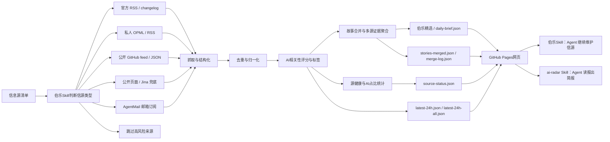

<div align="center">

# 私人情报所

## Private Intelligence Observatory

**让每一个专业领域，都能用 AI 建立自己的可审计、可持续情报体系。**

[](https://github.com/mizzlelover/private-intelligence-observatory/actions/workflows/domain-intelligence.yml)
[](LICENSE)

[先看演示站](https://mizzlelover.github.io/private-intelligence-observatory/demo/) · [使用者指南](docs/PRIVATE_INTELLIGENCE_FOR_PRACTITIONERS.md) · [核心方法论](docs/DOMAIN_INTELLIGENCE_V0_1.md) · [领域情报引擎](packages/domain-intelligence/README.md) · [项目范围与来源/版权](docs/PROJECT_SCOPE_AND_ATTRIBUTION.md) · [NOTICE](NOTICE.md) · [English](README.en.md)

</div>

---

> **主次与来源说明：**本项目的核心是领域情报方法论与通用引擎；仓库内的 AI News Radar、Radar Skill 和伯乐 Skill 是来自或基于 LearnPrompt/ai-news-radar 的可选兼容适配层，不是本项目原创核心。请先读 [NOTICE](NOTICE.md) 和 [项目范围与来源/版权说明](docs/PROJECT_SCOPE_AND_ATTRIBUTION.md)。

## 为什么需要“私人情报所”

AI 时代，几乎所有人都在教 AI 从业者追踪 AI、整理 AI、构建 AI 工具。但一个做文旅、制造、教育、农业、医疗、能源、城市建设，或任何具体专业的人，如果想让 AI 长期替自己盯住行业、找到关键变化、形成判断，网上几乎没有一套真正为他准备好的方法。

需要这套能力的人，往往不会用爬虫、RSS、Prompt、数据库和 GitHub 上的各种零件；会搭工具的人，又往往只围绕自己熟悉的 AI 领域搭建信息流。结果是：真正懂行业的人没有情报机制，真正会做工具的人没有替他理解业务问题。

**私人情报所要补上的，正是这条断路。**你不必先学会一套技术栈，也不必把自己的专业问题翻译成 AI 黑话。你只需要先说清楚：你正在做什么判断、最怕漏掉什么变化、希望每天知道什么。系统再把它变成一套能够持续采集、验证、解释、推送和改进的个人情报体系。

它不是一个 AI 新闻网页，也不是把更多链接塞给你。它把你的专业目标变成：

- 一组必须长期掌握的问题；
- 一张知道“谁最早知道什么”的信源地图；
- 一套经过历史回放和互补组合检验的来源；
- 一份诚实标出“已知、待确认和仍然不知道”的每日简报。

它服务的不是某一个行业，而是那些希望把 AI 用在自己专业判断上的人：行业负责人、研究者、内容工作者、项目经理、顾问、教师、创业者，以及任何不想被信息流牵着走的从业者。

> **一句话：你提供专业问题，私人情报所负责把它变成长期工作的情报机制。**

先用一个具体问题体验：[打开私人情报所演示站](https://mizzlelover.github.io/private-intelligence-observatory/demo/)。想理解应用层方法，请读[面向专业从业者的使用指南](docs/PRIVATE_INTELLIGENCE_FOR_PRACTITIONERS.md)；想进入工程实现，再读下面的核心引擎。

## 这是什么

这是一个以方法论为核心、以工程为支撑的“私人情报所”。日报、网页和推送只是最后的交付形式；真正的产品，是帮助你从一个现实判断开始，建立一套持续有效的领域情报系统。

它不是把 AI 新闻换个名字，也不是把某个现成的 AI 日报 Skill 包装成新工程。仓库里保留的 AI News Radar 和伯乐 Skill 是明确标注来源的可选兼容层；本项目自己的核心，是面向任意专业领域的需求建模、信源评价、历史回放、组合选择、覆盖审计和反馈闭环。

```text
决策目的
→ Intelligence Requirement Graph
→ Essential Information Elements
→ Expert Attention Reconstruction
→ Point-in-time Source Benchmark
→ Source Portfolio
→ Coverage Audit
→ Domain-ranked Daily Brief
→ Feedback
```

这里的日报只是输出形态，方法论和评价闭环才是项目主体。

## 30秒理解项目

**① 先说一个判断** → 先读[使用者指南](docs/PRIVATE_INTELLIGENCE_FOR_PRACTITIONERS.md)，用自己的工作语言写下“我准备判断什么、必须知道什么”。

**② 把问题变成系统** → 再读[核心方法论](docs/DOMAIN_INTELLIGENCE_V0_1.md)，把用户目的拆成 PIR、EIE、主题权重和事件优先级。

**③ 运行核心工程** → 用[Domain Intelligence Bootstrap](packages/domain-intelligence/README.md)执行 EAR、历史回放、组合优化、覆盖审计和日报生成：

```bash
uv run --project packages/domain-intelligence dib \
  packages/domain-intelligence/examples/data-elements.json \
  --output-dir out/domain-intelligence
```

**④ 接入现实采集与推送** → 把公开 RSS、网页、数据库、邮件或其他适配器整理成结构化信号，再交给核心引擎；采集、推送和现成网页都是可替换的边界层。

**⑤ 只想看 AI 日报** → 可以使用下方明确标注的 [AI News Radar 兼容适配层](#可选适配层ai-news-radar--伯乐-skill)，但它不是本项目的核心方法论，也不是本项目原创的伯乐 Skill。

---

## 核心工程：领域情报引擎

如果目标是为数据要素、机器人、文旅、网络安全、教育或任意新领域建立可审计的情报体系，使用仓库内的 [Domain Intelligence Bootstrap](packages/domain-intelligence/README.md)。它把用户目的拆成情报需求和必需信息要素，再执行专家注意力重建、历史截点回放、信源组合优化、覆盖审计和日报生成。

完整方法论见 [私人情报所：领域情报方法论 V0.1](docs/DOMAIN_INTELLIGENCE_V0_1.md)。最小示例：

```bash
uv run --project packages/domain-intelligence dib \
  packages/domain-intelligence/examples/data-elements.json \
  --output-dir out/domain-intelligence
```

输出的 `bootstrap-report.json` 可供后续系统消费，Markdown 报告用于人工复核和交接；它与现有 AI News Radar 的采集、RSS 和 GitHub Actions 保持边界分离。

## 项目归属、来源与版权

本项目的核心资产是本仓库新增并持续维护的领域情报方法论、数据模型、回放/组合/覆盖算法、通用引擎和领域适配边界。原有 AI News Radar 页面、采集脚本、雷达 Skill 和伯乐 Skill 属于单独的兼容适配层。

完整的来源、版权、许可证和目录边界见 [项目范围与来源/版权说明](docs/PROJECT_SCOPE_AND_ATTRIBUTION.md)。打开 `skills/ai-news-radar/` 或 `skills/radar/` 时，也应先看其中的来源说明。

## 可选适配层：AI News Radar / 伯乐 Skill

以下内容描述的是仓库中保留的 AI News Radar 兼容适配层，用于复用现成的 AI 日报采集、去重、静态页面和 Agent 消费流程。它不是私人情报所的核心，也不能替代需求建模、历史回放和覆盖审计。


兼容适配层的静态页面已从仓库根首页移到 [`legacy-ai-radar.html`](legacy-ai-radar.html)，根首页现在直接进入[私人情报所演示站](https://mizzlelover.github.io/private-intelligence-observatory/demo/)。这样既保留上游轮子的可运行入口，也不会再让它占据本项目的产品首页。

### 伯乐 Skill（外部工程适配层）的既有能力

好新闻分散在各处，

官方博客发一点，更新日志发一点，X上有人提前爆料，聚合站又把同一个新闻转来转去。

我以为的自己在追前沿，实际每天都在重复三件事，

打开几十个页面，肉眼+人脑过滤重复内容，猜哪条值得看。

让伯乐Skill先替你完成第一轮判断，**哪些信源是千里马，哪些是噪音**。

你可以随意增加信息源，还可以把一个信息源纳入输入范围，先让它在单独运行一周，再判断要不要录入。

这个兼容适配层不只是把信息抓回来，

它更像是一条轻量的新闻pipeline，把来源判断、抓取、去重、AI强相关过滤、信息源健康状态和静态网页发布串起来，上线后不消耗模型额度。

### 适配层能做什么

#### 给普通读者

- 打开在线页面，直接看最近24小时AI、模型、Agent、开发者工具和技术生态更新
- 通过“伯乐精选”先看高价值故事线，再不用从几百条消息里肉眼筛选
- 在“AI信号流”里继续查看完整AI强相关消息
- 用站点、关键词、时间和来源筛选快速定位信息
- 看到每条消息的AI标签、AI相关性分数、来源平台和发布时间
- 通过源健康和AI占比判断：哪些源是真有料，哪些源更新很多但AI含量低

#### 给内容创作者

- 保留原始来源链接，方便继续深挖、核对事实和做选题
- 把同一个事件的多个来源聚合到一起，减少重复阅读
- 用AI标签快速判断一条消息适合做图文、短视频、还是工具实测
- 用多源重合、官方一手、单源观察等信号判断选题可信度和优先级

#### 给开发者和Agent

- 默认不需要 API Key、不需要登录态、不需要 LLM额度
- 支持官方 RSS/changelog、精选 AI 媒体 RSS、OPML/RSS、公开 GitHub feed/JSON、静态页面、AgentMail 等来源类型
- GitHub Actions自动生成 `data/*.json` 并发布到 GitHub Pages
- Codex / Claude Code / Hermes / OpenClaw 可以通过兼容适配层中保留的伯乐Skill维护 AI 信源、抓取逻辑和页面
- 高级来源可以通过 GitHub Secrets或本地环境变量接入，避免把 token、cookies、私有 OPML 和邮箱正文写进仓库

### 适配层历史版本：v0.7

v0.6 把分散的消息合并成了故事线。v0.7 回答的是下一个问题：

**故事多了之后，怎么知道现在什么最热？**

v0.7 重点能力包括：

- **当前热点视图**：伯乐精选新增热点模式，按多源聚簇 × 时间衰减排序——几个独立信源同时在说的事，才配叫热点。没有足够多源热点时，这个视图自动隐藏。
- **社区分类**：原“中文”栏目升级为“社区”，收纳 WaytoAGI、AIbase、中文媒体/公众号、Follow Builders/X 等社区型信号；WaytoAGI 不再作为首页常驻大板块，而是在社区栏目里展示最近更新日和近 7 日记录。
- **头条式 Top3**：Top3 不只按时间或单一 AI 相关度排序，而是综合 AI HOT 原站分/内部相关度、官方/精选源权重、多源确认、48 小时新鲜度衰减和同源惩罚，尽量接近“先看什么”的编辑排序。
- **宁缺毋滥门槛**：精选席位必须靠多源确认或高分挣来，安静的日子精选区直接消失，不留空壳，页面回到纯时间轴。
- **评分回测工具**：`scripts/backtest_scoring.py` 把任意两个版本的评分逻辑在历史档案上重放对比。立下规矩：动评分必须附带 ≥14 天回测报告。
- **ai-radar 消费Skill**：装上后对Agent说"今天AI圈有什么"，它直接读本站公开JSON出中文简报——零API、零Key，数据管道可fork。

v0.6 引入的故事线合并、AI标签分数、源健康与AI占比，仍是这一切的地基。历次改动见 [Releases](https://github.com/LearnPrompt/ai-news-radar/releases)。

### 适配层工作原理



AI News Radar学习了现代新闻学的技术，不是简单堆信息源，一次性放几万条信息出来等于没用，所以我选择把新闻处理拆成稳定pipeline，抓取，去重，过滤，补充状态，生成静态站点。

在保证稳定性的同时追求轻量化，公开版不要求用户配置LLM API Key，不依赖登录态，cookies，X API和邮箱。需要这些进阶能力时，可以通过伯乐Skill用GitHub Secrets或本地环境变量接入。

### 适配层数据产物

每次更新会生成一组静态JSON文件，页面只读取这些文件，不需要后端服务。

核心文件包括：

- `data/latest-24h.json`：最近24小时AI强相关消息
- `data/latest-24h-all.json`：最近24小时全量消息
- `data/source-status.json`：来源抓取状态、成功率、站点覆盖和源健康
- `data/daily-brief.json`：伯乐精选故事线，供首页 Top 3 优先级和高价值入口使用
- `data/stories-merged.json`：故事合并后的完整事件集合，页面会在精选故事之后继续接入完整故事池
- `data/merge-log.json`：故事合并过程和命中记录，方便调试与审计

如果 `daily-brief.json` 暂时不存在，页面会回退到候选信号列表；如果 `stories-merged.json` 存在，页面会用完整故事池补齐后续故事线，避免只有少量精选故事被接入。

### 适配层快速开始

普通用户不用安装，直接打开[兼容适配层页面](legacy-ai-radar.html)即可查看它生成的 AI/文旅信号；如果你要建立自己的专业情报体系，应从[私人情报所演示站](https://mizzlelover.github.io/private-intelligence-observatory/demo/)开始。

想fork改造新版本，可以本地运行：

```bash
git clone https://github.com/LearnPrompt/ai-news-radar.git
cd ai-news-radar
python3 -m venv .venv
source .venv/bin/activate
pip install -r requirements.txt
python scripts/update_news.py --output-dir data --window-hours 24
python -m http.server 8080
```

打开：

```text
http://localhost:8080
```

如果你有自己的 OPML：

```bash
cp feeds/follow.example.opml feeds/follow.opml
# 把自己的订阅源写进 feeds/follow.opml，不提交这个文件
python scripts/update_news.py --output-dir data --window-hours 24 --rss-opml feeds/follow.opml
```

### 适配层 Agent 教程

如果你想让Codex / Claude Code / OpenClaw / Hermes帮你搭自己的版本，可以直接说：

```text
请使用伯乐Skill，先问我要信息源清单，然后帮我判断每个信源该用RSS、公开feed、静态页面、Jina兜底、AgentMail邮箱还是跳过。目标是部署一个不需要服务器、能用GitHub Actions自动更新的 AI 日报网站。不要把任何API Key、cookies、token、私有邮件内容写入仓库。
```

兼容适配层保留两个上游相关 Skill，分工是「雷达管读，伯乐管选」：

- `skills/radar/`：**ai-radar 雷达Skill**（消费侧）——不用fork就能装，自然语言问AI资讯，读本站公开JSON出简报
- `skills/ai-news-radar/`：**伯乐Skill**（维护侧）——fork后用它录入信源、维护抓取逻辑、部署 GitHub Pages

新Agent接手验收时，推荐先读：

- `README.md`
- `README.en.md`
- `docs/GPT_HANDOFF.md`
- `docs/SOURCE_COVERAGE.md`
- `docs/V2_PRODUCT_BRIEF.md`

### 适配层 GitHub 自动更新

`.github/workflows/update-news.yml` 已经配置好定时任务。

- 支持手动触发 `workflow_dispatch`；需要忽略 TikHub 的正常付费源间隔时，显式传入 `force_tikhub=true`
- 默认每 30 分钟运行一次：`*/30 * * * *`
- 自动生成并提交 `data/*.json`；工作流使用 `git add data/`，避免新增 JSON 文件因为白名单遗漏而停留在旧更新时间
- 如果没有设置 `FOLLOW_OPML_B64`，线上工作流会自动使用智慧文旅信源 `feeds/wisdom-tourism.opml`；如该文件不存在，再回退到公开示例 `feeds/follow.example.opml`
- 如果设置 `FOLLOW_OPML_B64`，会优先自动解码为私有 `feeds/follow.opml`
- 如果设置 `EMAIL_DIGEST_ENABLED=1`、`AGENTMAIL_API_KEY`、`AGENTMAIL_INBOX_ID`，会生成脱敏邮箱摘要
- 只有额外设置 `EMAIL_DIGEST_PUBLISH=1`，才会提交 `data/email-digest.json`
- 如果设置 `X_API_ENABLED=1`、`X_BEARER_TOKEN` 和预算变量，会在每日指定UTC窗口用官方X API抓取少量公开Post；默认关闭，且当前X API按返回资源计费
- 如果设置 `SOCIALDATA_ENABLED=1`、`SOCIALDATA_API_KEY` 和预算变量，会按 `SOCIALDATA_RUN_INTERVAL_HOURS`（默认12小时）通过 SocialData.tools 抓取少量公开 X/Twitter 搜索结果；默认关闭，API Key 只应放在本地环境变量或 GitHub Secrets
- 如果设置 `TIKHUB_ENABLED=1`、`TIKHUB_API_KEY` 和预算变量，会按 `TIKHUB_RUN_INTERVAL_HOURS`（默认24小时）通过 TikHub 抓取少量抖音/小红书关键词搜索结果；默认关闭，API Key 只应放在本地环境变量或 GitHub Secrets
- SocialData/TikHub 的拉取间隔会记录在 `data/paid-source-state.json`，只保存上次运行时间、结果数和错误名，不保存 API Key；半小时工作流跳过付费源时，旧条目仍保留在 `data/archive.json`，不会因为本轮未拉取就被清空

默认情况下，本项目不需要任何API Key就能跑核心流程。

线上页面右上角显示的“更新时间”来自 `data/latest-24h.json` 的 `generated_at`。如果页面长时间停在旧时间，优先检查 GitHub Actions 最近一次 `Update AI News Snapshot` 是否运行、是否有抓取错误、以及仓库 Pages 是否部署到包含最新 `data/` 提交的分支。

高级源配置模板见 `examples/advanced-sources.env.example`，

预算说明见 `docs/research/advanced-source-free-tier-budget-2026-05-10.md`，

本地测试 TikHub 抓取时可以先小流量强制跑一次：

```bash
export TIKHUB_ENABLED=1
export TIKHUB_API_KEY='你的 TikHub API Key'
export TIKHUB_FORCE_RUN=1
export TIKHUB_QUERY='OpenAI,Claude,大模型,Agent,AI工具,人工智能,AI'
export TIKHUB_PLATFORMS=douyin,xiaohongshu
export TIKHUB_MAX_RESULTS=10
export TIKHUB_DAILY_ITEM_LIMIT=10
python3 scripts/probe_tikhub.py --query 'OpenAI,Claude,大模型,Agent,AI工具,人工智能,AI' --platforms douyin,xiaohongshu --max-results 10
python3 scripts/update_news.py --output-dir /tmp/ai-news-radar-tikhub --window-hours 24 --archive-days 3
python3 - <<'PY'
import json
from collections import Counter

status = json.load(open("/tmp/ai-news-radar-tikhub/source-status.json"))
latest = json.load(open("/tmp/ai-news-radar-tikhub/latest-24h-all.json"))
print("failed_sites =", status.get("failed_sites"))
print("empty_advanced_sources =", status.get("empty_advanced_sources"))
print("tikhub_status =", [s for s in status.get("sites", []) if str(s.get("site_id", "")).startswith("tikhub")])
counts = Counter(i.get("site_id") for i in latest.get("items_all_raw", []))
print("tikhub_24h_counts =", {k: counts[k] for k in sorted(counts) if str(k).startswith("tikhub")})
PY
```

远端需要用当前 `master` 立即重跑 TikHub 时：

```bash
gh workflow run update-news.yml --ref master -f force_tikhub=true
```

自媒体栏目使用独立的 7 天热榜池，不改变其他栏目的 24 小时窗口。抖音和
小红书搜索都优先请求“一周内最多点赞”，再从响应中提取点赞、收藏、评论
和分享数。榜单分数由 85% 互动热度和 15% 的 24 小时新鲜度加分组成；因此
真正的周内爆款优先，但刚开始起量的新内容仍有机会进入 Top 3。

小红书按“先搜索、后详情”处理。搜索阶段使用 App V2 的最多点赞排序和
7 天筛选，并再次在本地校验发布时间：可信 API 时间优先；`0`、未来时间
或缺失时间会回退到 note id 的时间前缀；仍无法确认或早于 7 天的笔记会被
跳过。通过时间门禁后，如需补齐图文详情，可按需调用官方详情接口：

```python
import os
import requests

headers = {"Authorization": f"Bearer {os.environ['TIKHUB_API_KEY']}"}

search = requests.get(
    "https://api.tikhub.io/api/v1/xiaohongshu/app_v2/search_notes",
    headers=headers,
    params={
        "keyword": "AI",
        "page": 1,
        "sort_type": "popularity_descending",
        "note_type": "不限",
        "time_filter": "一周内",
    },
    timeout=30,
)
search.raise_for_status()

# Only request details after the search result passes the local 7-day time gate.
detail = requests.get(
    "https://api.tikhub.io/api/v1/xiaohongshu/app_v2/get_image_note_detail",
    headers=headers,
    params={"note_id": "通过时间校验的 note_id"},
    timeout=30,
)
detail.raise_for_status()
print(detail.json())
```

视频笔记使用 `get_video_note_detail`。详情接口用于补充作者、互动量、图片、
标签等结构化字段，不替代搜索阶段的发布时间判断。

X API演示配置见 `docs/guides/x-api-demo-config.md`；

单账号/单newsletter演示见 `docs/guides/rileybrown-alphasignal-demo.md`。

## License

[MIT](LICENSE)
